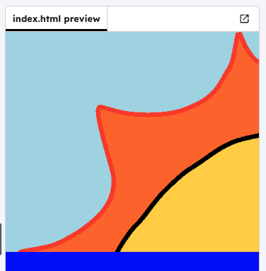

<h2 class="c-project-heading--task">Add the sun</h2>

--- task ---

Start by adding an image for the sun.

--- /task ---

--- code ---
---
filename: index.html
language: html
line_numbers: true
line_number_start: 8
line_highlights: 11
---
  <body>
  
    

      
    

    
    

</body>
--- /code ---

--- task ---

Click **Run** to test. You should see a **sun image** appear. It will be huge, and the size is change in the next step.

--- /task ---

