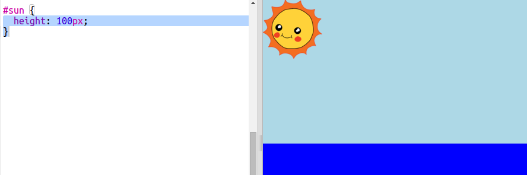

<h2 class="c-project-heading--task">Creating the sun</h2>

--- task ---

Start by adding an image for the sun.

--- /task ---

An image for the sun included in the gallery. Click on the tab to see.

--- code ---
---
filename: index.html
language: html
line_numbers: true
line_number_start:
line_highlights:
---

--- /code ---

