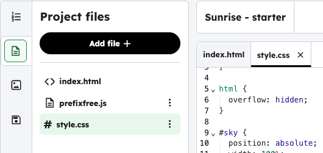
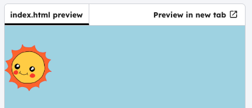

<h2 class="c-project-heading--task">Creating the sun</h2>

--- task ---

Resize and position the sun by adding the CSS code below.

--- /task ---

--- task ---

Click on the file icon and open `style.css`.

--- /task ---

--- code ---
---
filename: style.css
language: css
line_numbers: true
line_number_start:24
line_highlights: 24-29
---

#sun {
  position: absolute;
  left: 0;
  height: 100px;
  top: 40px; /* Move the sun down */
}

--- /code ---

### Tip

If you only set the `height`, the width updates automatically to keep the proportions the same.

--- task ---

**Test:** Run your project and check that the sun is smaller and has moved down the page.

--- /task ---

