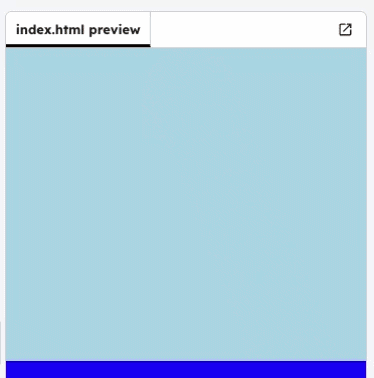

<h2 class="c-project-heading--task">Animating the sunrise</h2>

--- task ---

Create a `sunrise` keyframe animation that makes the sun rise and then set over 10 seconds.

--- /task ---

--- task ---

Open `style.css`.

Find your `#sun` CSS rule and make sure it uses the `sunrise` animation.

Then add a `@keyframes sunrise` animation at the end of the file so the sun starts at the bottom, reaches the top halfway through, then returns to the bottom.

--- /task ---

--- code ---
---
filename: style.css
language: css
line_numbers: true
line_number_start: 24
line_highlights: 29, 32-36
---

#sun {
  position: absolute;
  left: 0;
  height: 100px;
  top: 40px; /* Move the sun down */
  animation: sunrise 10s infinite; /* Run the sunrise animation over 10 seconds, repeating forever */
}

@keyframes sunrise {
  0%   { left: 0;   top: 120%; }
  50%  { left: 40%; top: 0; }
  100% { left: 80%; top: 120%; }
}

--- /code ---

### Tip

Tip

- 0% represents the very start of the animation timeline.
- 100% represents the very end.

Each keyframe defines the sun’s position at a specific point in that timeline. The browser smoothly transitions between those positions.

Because the sun element is positioned inside the `.sky` div, its `top` and `left` values are calculated relative to that container — not the entire webpage.

For example:

- `top: 0%` places the sun at the top edge of the sky.

- `top: 100%` places the sun at the bottom edge of the sky.

It does not refer to the top or bottom of the whole page, only the boundaries of the `.sky` element.

--- task ---

**Test:** Run your project and check the sun rises up to the top, then sets again, and repeats.

--- /task ---

