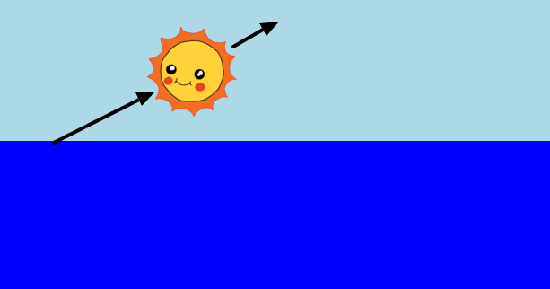

<h2 class="c-project-heading--task">Challenge: Diagonal animation</h2>

--- task ---

Change the angle

--- /task ---

Something about where 0% is

Experiment with differnt directions and percenathes

You can use the `left` property at 40 to do this, for example:

--- code ---
---
filename: style.css
language: css
line_numbers: true
line_number_start:
line_highlights:
---

left: 40%;

--- /code ---

Output

