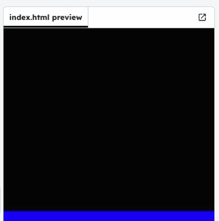

## Sky

Animate the sky so it turns dark at night after the sun has set.

Open `style.css` and find the `#sky` CSS rule.

Add an animation called `sky` so the background colour changes over time.

Then add a `@keyframes sky` animation so the sky is dark at the start and end, and light blue in the middle.

```css filename="style.css" line_numbers="true" line_number_start="9" line_highlights="15-23"

#sky {
  position: absolute;
  top: 0;
  width: 100%;
  height: 50%;
  background: lightblue;
  animation: sky 10s infinite; /* Match the sun's timing so they sync */
}

@keyframes sky {
  0%   { background: black; }
  33%  { background: lightblue; }
  66%  { background: lightblue; }
  100% { background: black; }
}

```

> [!TIP]
>
> - You can experiment with colours by typing a colour name (like `blue`) and clicking it in the editor to preview
> - Try changing `lightblue` to another colour to make a different daytime sky

## Now run your code

Run your project and check the sky changes colour over time, getting darker when the sun is “down”.


