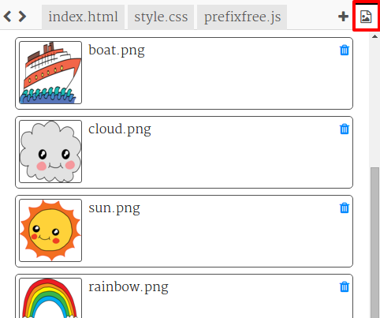
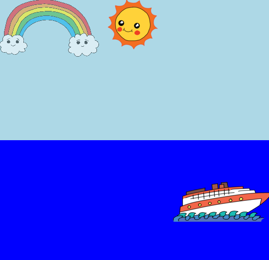

<h2 class="c-project-heading--task">Challenge: More animation</h2>

--- task ---

Animate another image by creating a new `@keyframes` rule and applying it with `animation:`.

--- /task ---

--- task ---

To animate a new item, you will need to:

- Include it in your HTML with an `id`
- Add a CSS style for that `id`
- Create an `@keyframes` rule
- Use `animation:` in the style to run the keyframes

Click on the image icon to see the images included in the project.

You can also upload your own images if you like.

Don’t forget you can put items in the sea as well as the sky:

--- /task ---

--- code ---
---
filename: style.css
language: css
line_numbers: true
line_number_start: 1
line_highlights: 1-8
---

@keyframes fade {
  0%   { opacity: 0; }
  50%  { opacity: 1; }
  66%  { opacity: 1; }
  100% { opacity: 0; }
}

--- /code ---

### Tip

- `opacity` goes from `0` (invisible) to `1` (fully visible).
- If you want something to appear later, try starting it off-screen with a negative `left` value.

--- task ---

**Test:** Run your project and check that your new animated item changes over time (for example, it fades in and out).

--- /task ---

