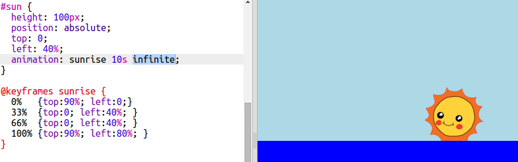

<h2 class="c-project-heading--task">sky</h2>

--- task ---

ANimate sly 

--- /task ---

Animation isn't just for movement. Let's animate the sky to turn dark at night.

+ Add an animation called `sky` to your CSS:

--- /code ---

 

+ Now you just need to add the word `infinite` to the `#sun` animation to make it loop forever:

    

+ Test out your animation. Does the sun keep rising and setting? 

#sky {
  position: absolute;
  top: 0;
  width: 100%;
  height: 50%;
  background: lightblue;
  animation: sky 10s infinite;
}

@keyframes sky {
  0%   {background:black;}
  33%  {background:lightblue;}
  66%  {background:lightblue;}
  100%  {background:black;}
}

experiemt with colrus - type colours in the editor i.e. blue then click