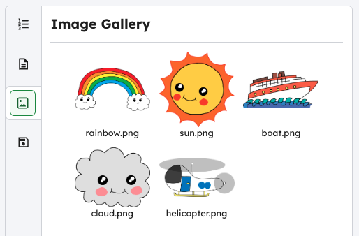

<h2 class="c-project-heading--task">Challenge</h2>

--- task ---

Add more animations to your project.

--- /task ---

--- task ---

To animate a new item, you will need to:

- Include it in your HTML with an `id`
- Add a CSS style for that `id`
- Create an `@keyframes` rule
- Use `animation:` in the style to run the keyframes

Click on the image icon to see the images included in the project.

Don’t forget you can put items in the sea as well as the sky:

--- /task ---

