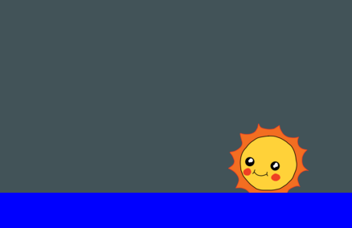

<h2 class="c-project-heading--task">Challenge: Improve the sky</h2>

--- task ---

Can you change the sky animation so that it matches the sun and stays blue during the day and returns to black as the sun sets. Make it loop forever too. 

--- /task ---

@keyframes sky {
  0%   {background:black;}
  33%  {background:lightblue;}
  66%  {background:lightblue;}
  100%  {background:black;}
}